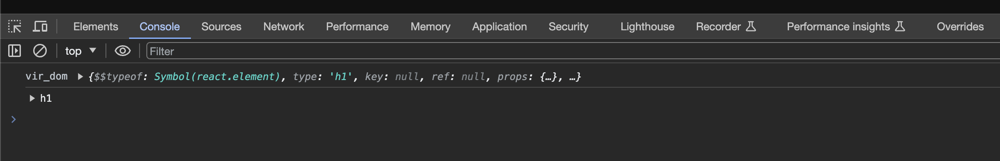

## E04

### Virtual DOM, Reconciliation and Diffing Algorithm in React

- **Virtual DOM**

Virtual DOM is an object identical to the JavaScript Object. In other words, Virtual DOM is simply a programming concept or a representation of a DOM object in memory as a virtual form. Virtual DOM has the same power and has properties and methods as the real DOM object (not 100% same as real dom) . But Virtual DOM is not directly responsible for displaying elements on UI.


- **console Virtual DOM and Real DOM**

```jsx
import { useState } from 'react'
import styles from './counters.module.css'

function MyButton() {
  const [count, setCount] = useState(0)

  function handleClick() {
    const vir_dom = <h1>This is a Button (virtual)</h1>
    const real_dom = document.createElement('h1');

    real_dom.innerText = 'This is a Button (real)'

    console.log('vir_dom',vir_dom )
    console.dir(real_dom) // real dom
    setCount(count + 1)
  }

  return (
    <div>
      <button onClick={handleClick} className={styles.counter}>
        Clicked {count} times
      </button>
    </div>
  )
}

export default function MyApp() {
  return <MyButton />
}
```




- **Reconciliation**

When React App gets rendered for the first time on the browser, it basically creates a fresh copy of the DOM object as a render tree along with a Virtual DOM in memory for future updates. Later when a component gets updated due to state or props changes, the component and its children get re-rendered. While Updating Virtual DOM, React takes a snapshot of Virtual DOM at each time just before updating Virtual DOM. Now one contains the updated Virtual DOM and one which is just the preupdated version of this updated Virtual DOM. Now it compares the preupdated version with the updated Virtual DOM and works out the changes for instance what part of UI has been changed in the DOM. To update UI, React syncs the actual DOM object with Virtual DOM which is stored in memory using a library such as ReactDOM. This process is called Reconciliation.

Reconciliation is a process where Virtual DOM is a DOM representation in memory that is in sync with Real DOM. React use the Diffing algorithm to compare Virtual DOM and preupdated Virtual DOM to update DOM.


- **Diffing algorithm**

a diffing algorithm is a method used to compare two sets of data and identify the differences between them. In the context of web development and frameworks like React, a diffing algorithm is employed to efficiently update the user interface based on changes in the 